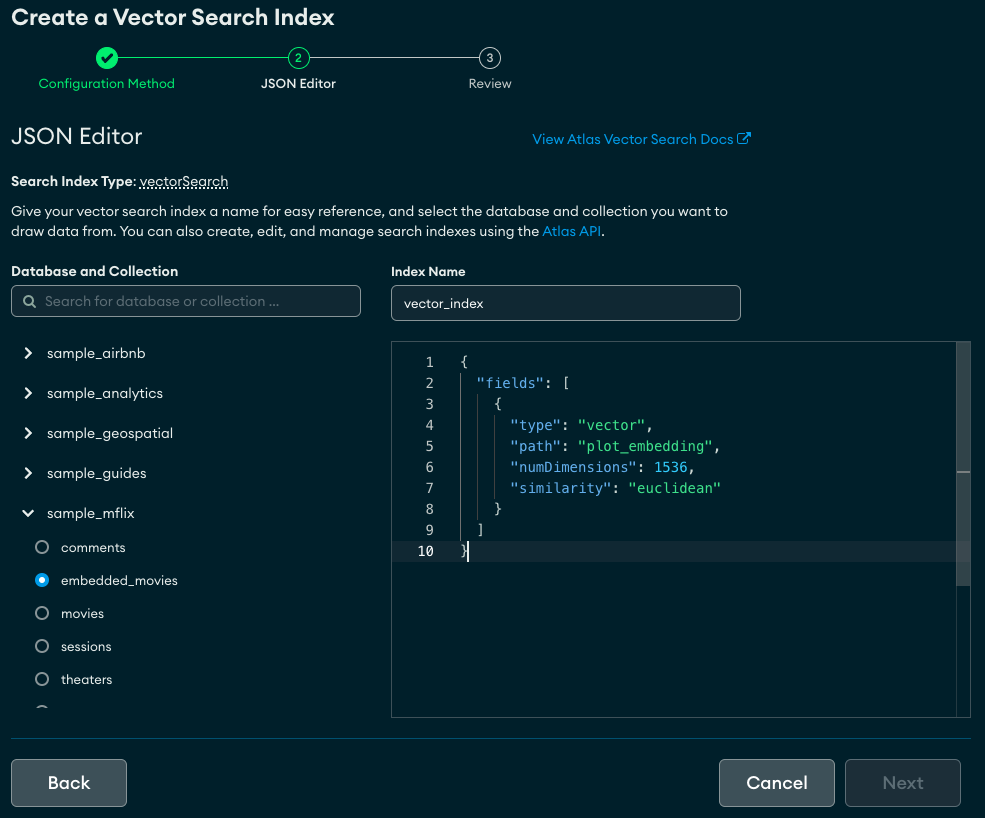
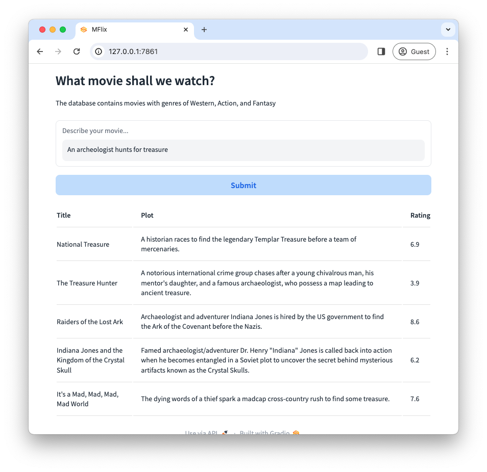

# What Movie Shall We Watch?

Vector Search introduces a whole new level of search capabilites. To highlight this point, MongoDB Atlas has added a new movie collection, [embedded_movies](https://www.mongodb.com/docs/atlas/sample-data/sample-mflix/#sample_mflix.embedded_movies), that has vectorized the plot field.  I will show you how we can now search that data to find a movie of interest.

## Prerequisites
* [MongoDB Atlas Subscription](https://cloud.mongodb.com/) (Free Tier is fine)
* OpenAI [API key](https://platform.openai.com/account/api-keys)

## Quick Setup Steps

### Atlas UI
1. Load the Sample Dataset

Click the Ellipses (...) button for your database deployment and select Load Sample Dataset.


_Note, if you've previously loaded the Sample Dataset, you may have to reload to pick up the new [embedded_movies](https://www.mongodb.com/docs/atlas/sample-data/sample-mflix/#sample_mflix.embedded_movies) collection._

2. Create the Search Index

After the Sample Dataset loaded, select **Create Index** under ATLAS SEARCH in the lower right corner of the deployment window:


Select the option to create an **Atlas Vector Search** index and supply the following index defination: 

```json
{
  "type": "vectorSearch",
  "fields": [
    {
      "numDimensions": 1536,
      "path": "plot_embedding",
      "similarity": "euclidean",
      "type": "vector"
    }
  ]
}
```



### Command Line (Terminal)

1. Get the code:
```zsh
git clone https://github.com/wbleonard/movie_recommendations.git
```
2. Update [params.py](params.py) with your MongoDB connection string and Open AI [API key](https://platform.openai.com/account/api-keys).
```py
OPENAI_API_KEY='OpenAI API Key'
MONGODB_CONN_STRING='MongoDB Connection String'
```
3. Create a new Python environment
```zsh
python3 -m venv env
```
4. Activate the new Python environment
```zsh
source env/bin/activate
```
5. Install the requirements
```zsh
pip3 install -r requirements.txt
```

## Discover (CLI)
```zsh
python3 recommend.py -t "A poisened man fights to find the antidote"                                                                         
{
    "plot": "Professional assassin Chev Chelios learns his rival has injected him with a poison that will kill him if his heart rate drops.",
    "title": "Crank",
    "rating": 7.0,
    "score": 0.7921234369277954
} 

{
    "plot": "A hapless store clerk must foil criminals to save the life of the man who, miniaturized in a secret experiment, was accidentally injected into him.",
    "title": "Innerspace",
    "rating": 6.7,
    "score": 0.7871337532997131
} 

{
    "plot": "A policeman white blood cell, with the help of a cold pill, must stop a deadly virus from destroying the human they live in, Frank.",
    "title": "Osmosis Jones",
    "rating": 6.2,
    "score": 0.7847602367401123
} 

{
    "plot": "A short-term memory loss patient sets out on his journey to avenge the death of his beloved girl.",
    "title": "Ghajini",
    "rating": 7.3,
    "score": 0.779862105846405
} 

{
    "plot": "Scientists poison the water supply of a small town, turning the residents into homicidal maniacs who kill each other and anybody who passes through.",
    "title": "Death Street USA",
    "rating": 4.6,
    "score": 0.7795642614364624
} 

```

## Discover (UI)

```zsh
python3 app.py
```

[http://127.0.0.1:7861](http://127.0.0.1:7861)



